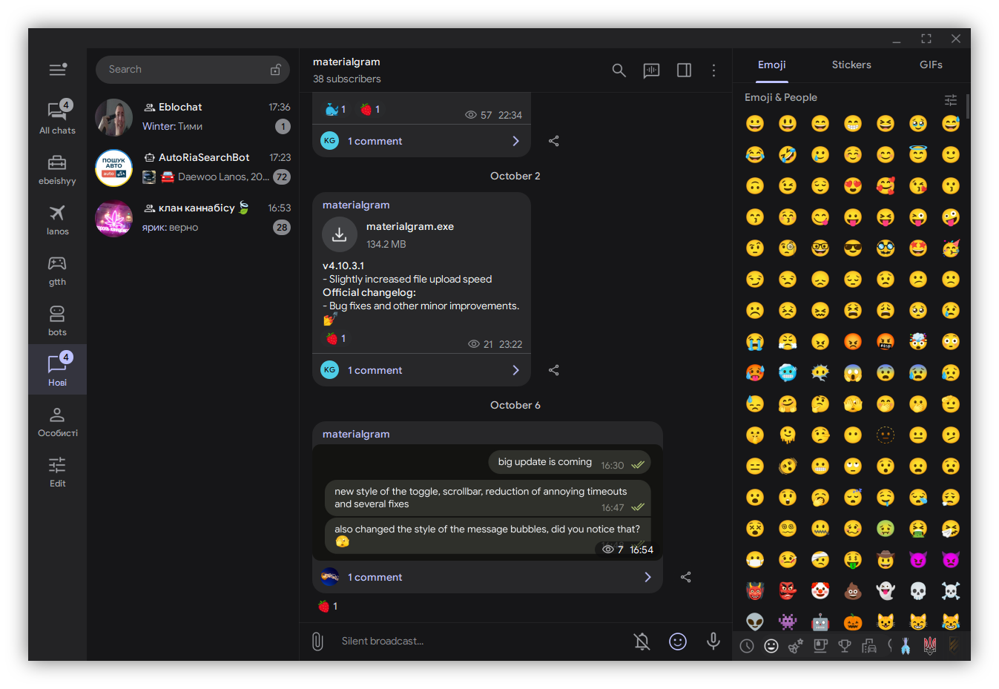
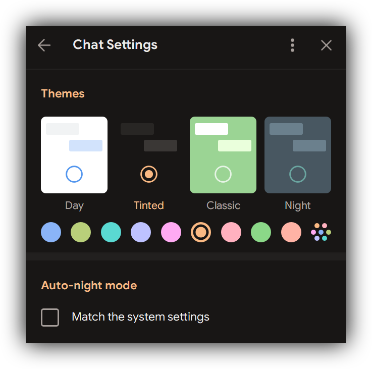

# [materialgram][telegram_desktop] – Telegram Desktop fork

This is the source code and the build instructions for the **materialgram** client, based on the [Telegram API][telegram_api] and the [MTProto][telegram_proto] secure protocol

The source code is published under GPLv3 with OpenSSL exception, the license is available [here][license]

## Changelog and plans:
- [x] Add "Google Day" and "Google Dark" themes to settings
- [x] Replace font with **Google Sans** (except for Arabic characters that use the **Vazir** font)
- [x] Replace all icons with Material ones
- [x] Replace the sounds
- [x] Remove message bubble tails
- [x] Reduce image compression
- [x] Reduce minimum window size
- [x] Reduce some annoying timeouts
- [x] Increase upload speed
- [x] Improve spoiler animation
- [x] Show the approximate date of account creation in the profile

## Build instructions (tested only on Windows)
* [(Windows 64-bit)][win64]
* [macOS][mac]
* [GNU/Linux using Docker][linux]

## Third-party
* **Qt 6** ([LGPL](http://doc.qt.io/qt-6/lgpl.html)) and **Qt 5.15** ([LGPL](http://doc.qt.io/qt-5/lgpl.html)) slightly patched
* **OpenSSL 1.1.1 and 1.0.1** ([OpenSSL License](https://www.openssl.org/source/license.html))
* **WebRTC** ([New BSD License](https://github.com/desktop-app/tg_owt/blob/master/LICENSE))
* **zlib 1.2.11** ([zlib License](http://www.zlib.net/zlib_license.html))
* **LZMA SDK 9.20** ([public domain](http://www.7-zip.org/sdk.html))
* **liblzma** ([public domain](http://tukaani.org/xz/))
* **Google Breakpad** ([License](https://chromium.googlesource.com/breakpad/breakpad/+/master/LICENSE))
* **Google Crashpad** ([Apache License 2.0](https://chromium.googlesource.com/crashpad/crashpad/+/master/LICENSE))
* **GYP** ([BSD License](https://github.com/bnoordhuis/gyp/blob/master/LICENSE))
* **Ninja** ([Apache License 2.0](https://github.com/ninja-build/ninja/blob/master/COPYING))
* **OpenAL Soft** ([LGPL](https://github.com/kcat/openal-soft/blob/master/COPYING))
* **Opus codec** ([BSD License](http://www.opus-codec.org/license/))
* **FFmpeg** ([LGPL](https://www.ffmpeg.org/legal.html))
* **Guideline Support Library** ([MIT License](https://github.com/Microsoft/GSL/blob/master/LICENSE))
* **Range-v3** ([Boost License](https://github.com/ericniebler/range-v3/blob/master/LICENSE.txt))
* **Vazir font** ([SIL Open Font License 1.1](https://github.com/rastikerdar/vazir-font/blob/master/OFL.txt))
* **Emoji alpha codes** ([MIT License](https://github.com/emojione/emojione/blob/master/extras/alpha-codes/LICENSE.md))
* **Catch test framework** ([Boost License](https://github.com/philsquared/Catch/blob/master/LICENSE.txt))
* **xxHash** ([BSD License](https://github.com/Cyan4973/xxHash/blob/dev/LICENSE))
* **QR Code generator** ([MIT License](https://github.com/nayuki/QR-Code-generator#license))
* **CMake** ([New BSD License](https://github.com/Kitware/CMake/blob/master/Copyright.txt))
* **Hunspell** ([LGPL](https://github.com/hunspell/hunspell/blob/master/COPYING.LESSER))

[//]: # (LINKS)
[telegram_desktop]: https://github.com/kukuruzka165/materialgram
[telegram_api]: https://core.telegram.org
[telegram_proto]: https://core.telegram.org/mtproto
[license]: LICENSE
[win64]: docs/building-win-x64.md
[mac]: docs/building-mac.md
[linux]: docs/building-linux.md
